# Dynamic Pod Lifecycle Management

**DevOps Architecture Assignment Submission**

This project implements a secure, event-driven, and self-healing infrastructure on Kubernetes. It dynamically creates dedicated compute resources (Pods) for unique users upon request and automatically terminates them after a period of inactivity to optimize costs.

## 🛠️ Tech Stack


---

## 🎥 Video Walkthrough

> **[CLICK HERE TO WATCH THE DEMO VIDEO (LOOM)]**
> *https://www.loom.com/share/6a151a9e92154a72bf9d48c6c5f24b55*
> 
> **[CLICK HERE TO WATCH THE DEMO VIDEO (Drive)]**
> 
> *https://drive.google.com/file/d/1WbKLsiVeV981Rl2q-PVubvPlpSOjQT-R/view*

---

## 🏗️ Architecture

The system uses an **Event-Driven Architecture** to decouple request handling from infrastructure provisioning.

```mermaid
graph TD
    User[👤 User / Client] -->|1. HTTP Request| Ingress[🌐 Ingress Controller]
    Ingress -->|Route| Gateway[🚀 Session Gateway]

    subgraph "Data Plane"
        Redis[(🗄️ Redis State)]
        RMQ((📨 RabbitMQ))
    end

    subgraph "Control Plane"
        Gateway
        Worker[⚙️ Lifecycle Worker]
        Reaper[💀 Reaper Service]
    end

    subgraph "Kubernetes Infrastructure"
        K8sAPI[☸️ K8s API Server]
        UserPod[📦 User Pod <br> 10.244.x.x]
    end

    %% Main Request Flow
    Gateway -->|Check Session| Redis
    Gateway -->|New Session? Publish| RMQ
    Gateway -.->|Long Poll Wait| Gateway
    
    %% Worker Flow (Async Creation)
    RMQ -->|Consume Event| Worker
    Worker -->|Create Pod| K8sAPI
    K8sAPI -.->|Provision| UserPod
    Worker -->|Update IP & Status| Redis

    %% Proxy Flow (Hot Path)
    Gateway -->|Session Ready?| Redis
    Gateway ==>|Proxy Traffic| UserPod

    %% Cleanup Flow (Reaper)
    Reaper -->|Scan for Idle > 10m| Redis
    Reaper -->|Delete Resource| K8sAPI
    K8sAPI -.->|Terminate| UserPod
```



### Component Breakdown

| Component | Type | Responsibility |
| :--- | :--- | :--- |
| **Ingress Controller** | Nginx | The entry point for all cluster traffic. Routes HTTP requests to the Gateway based on the hostname. |
| **Session Gateway** | FastAPI | **The "Brain".** Handles authentication, checks Redis for state, and acts as a smart proxy. If a session is missing, it publishes an event to RabbitMQ and waits. |
| **RabbitMQ** | Broker | **The "Decoupler".** Buffers creation requests to ensure the Gateway never blocks or crashes due to high load or slow K8s API responses. |
| **Lifecycle Worker** | Python | **The "Builder".** Consumes events, sanitizes User IDs, and communicates with the Kubernetes API to provision dedicated Pods securely. |
| **Reaper Service** | Python | **The "Janitor".** Runs in the background, scanning Redis for idle sessions (>10m) and deleting unused Pods to optimize resource costs. |
| **Redis** | Database | **The "State".** Stores the mapping between User IDs and Pod IPs. Acts as the single source of truth for the system. |

---

## 💡 Design Decisions & Rationale

### 1. Why Event-Driven?
By using **RabbitMQ** between the Gateway and the Worker, we decouple the user-facing service from the heavy infrastructure logic. If 1,000 users join at once, the Gateway stays responsive while the Worker processes the queue at a manageable pace.

### 2. Why a "Reaper" pattern?
Instead of relying on complex TTLs inside Kubernetes, a dedicated Reaper service provides fine-grained control over resource termination. This ensures we strictly adhere to the "10-minute idle" rule to save cloud costs.

### 3. Security First Strategy
* **RBAC:** The Gateway has **NO permissions** to talk to the K8s API. Only the internal Worker and Reaper have those privileges (Least Privilege Principle).
* **Secrets:** All credentials (RabbitMQ/Redis) are injected via Kubernetes Secrets, never hardcoded.
* **Sanitization:** The Worker strictly sanitizes User IDs to prevent injection attacks or invalid resource names.

---

## 🚀 Features Implemented

* ✅ **Dynamic Pod Lifecycle:** Pods are created on-demand via the Kubernetes API.
* ✅ **Smart Routing:** Subsequent requests are routed directly to the existing pod IP (Zero-latency hot path).
* ✅ **Event-Driven Trigger:** Uses RabbitMQ to handle creation asynchronously.
* ✅ **Self-Healing:** The Gateway automatically reconnects to message brokers; Kubernetes Deployments restart failed services.
* ✅ **Resource Optimization:** Automatic termination of idle resources (10-minute timeout).
* ✅ **Infrastructure as Code:** Terraform configuration included for AWS EKS provisioning.
* ✅ **CI/CD:** GitHub Actions workflow included for automated build and deploy.
* 🔒 **Security Compliance:**
    * Kubernetes Secrets for sensitive data.
    * Strict RBAC policies.
    * Input sanitization.

---

## 📋 Prerequisites

* **Minikube** (or any K8s cluster)
* **Docker**
* **Kubectl**
* **Helm**

---

## ⚙️ Setup & Installation

### 1. Start the Cluster
```bash
minikube start
minikube addons enable ingress
```

### 2. Install Dependencies (Redis & RabbitMQ)
```bash
# Install Redis using Helm
helm repo add bitnami [https://charts.bitnami.com/bitnami](https://charts.bitnami.com/bitnami)
helm install redis bitnami/redis --set auth.password=admin --set replica.replicaCount=1

# Install RabbitMQ
kubectl apply -f manifests/rabbitmq-deployment.yaml
```

### 3. Configure Infrastructure
```bash
# Apply Namespace
kubectl apply -f manifests/00-namespace.yaml

# Apply Secrets (Security)
kubectl apply -f manifests/01-secrets.yaml

# Apply RBAC Permissions
kubectl apply -f manifests/rbac.yaml
```

### 4. Build & Deploy Services
**Note:** Ensure your terminal is pointing to Minikube's Docker daemon.

```bash
eval $(minikube -p minikube docker-env)

# Build Images
docker build -t gateway-service:latest -f gateway/Dockerfile .
docker build -t worker-service:latest -f worker/Dockerfile .
docker build -t reaper-service:latest -f reaper/Dockerfile .

# Deploy
kubectl apply -f manifests/gateway-deployment.yaml
kubectl apply -f manifests/worker-deployment.yaml
kubectl apply -f manifests/reaper-deployment.yaml

# Expose Ingress
kubectl apply -f manifests/ingress.yaml
```

---

## 🧪 How to Test

**1. Simulate a New User (Cold Start):**
In a separate terminal, run:
```bash
curl -v -H "X-User-ID: demo-user-1" -H "Host: local.gateway.com" http://local.gateway.com
```
> **Observation:** The request will hang for ~15-30s while the Worker creates the pod. It will return the Apache "It Works!" page once ready.

**2. Simulate an Existing User (Hot Path):**
Run the same command again:
```bash
curl -v -H "X-User-ID: demo-user-1" -H "Host: local.gateway.com" http://local.gateway.com
```
> **Observation:** The response is instant. The Gateway routed directly to the pod.

**3. Verify Cleanup:**
Wait 10 minutes (or check logs) to see the Reaper terminate the pod.
```bash
kubectl logs -f deployment/reaper-deployment
```
